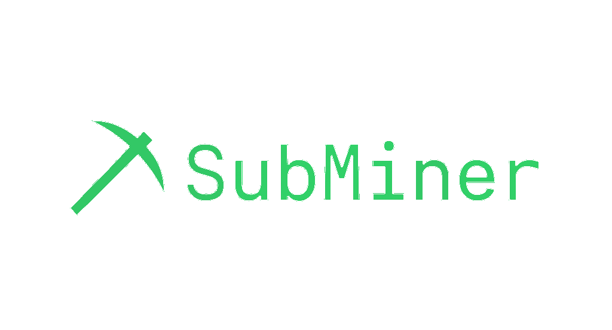

<p align="center">
  
</p>
<p align="center">
  <b align="center">SubMiner — Mine Reddit for raw startup gold, straight from the minds of users.</b>
</p>

<p align="center">
  <a href="https://www.python.org/"></a>
  <a href="LICENSE"></a>
  <a href="https://reddit.com"></a>
  <a href="#"></a>
</p>

---

> [!Note]
> This is a work in progress. Check back soon for new features and bug fixes.

---

SubMiner is a command-line tool that scrapes high-signal ideas and points of interest from Reddit threads and comments.

It uses keyword-based search, subreddit targeting, upvote filtering, and async crawling to extract information from communities like r/Entrepreneur, r/SideProject, and r/AppIdeas.

Comments are analyzed using NLP for sentiment and keyword density, helping you uncover the why behind user pain points — and turning that into validated product insight or prompt-ready startup seeds.

While the default configurations are tuned for startups, you can also use SubMiner to mine any subreddit or keyword of your choice.

---

## Features

- **Targeted Subreddit Scraping** – Focus on relevant communities like `r/AppIdeas`, `r/Entrepreneur`, `r/SideProject`, and more
- **Keyword Filtering** – Use startup-centric prompts like `"app to automate"` or `"side project"`
- **Async Fast** – Built on `asyncpraw`, optimized for high-speed multi-threaded scraping with backoff and error handling
- **NLP Enriched** – Analyze comment sentiment and extract dominant themes
- **Modular CLI** – Query top posts, view raw ideas, get summaries, and dump to SQLite for long-term exploration

## Why Use SubMiner?

Most good startup ideas start as complaints. Reddit is full of them. SubMiner helps you:

- Discover problems real users want solved
- Validate if there’s actual demand (via upvotes/comments)
- Mine comments for features, monetization hints, and competitive tools
- Feed data into LLMs, prompt chains, or MVP generators

## Requirements

- Python 3.10+
- `asyncpraw`, `pandas`, `textblob`, `spacy`, `nltk`, `aiohttp`
- SpaCy model: `en_core_web_md`

```bash
python -m nltk.downloader punkt stopwords averaged_perceptron_tagger
python -m textblob.download_corpora
python -m spacy download en_core_web_md
```

## Usage

```
   _____       __    __  ____
  / ___/__  __/ /_  /  |/  (_)___  ___  _____
  \__ \/ / / / __ \/ /|_/ / / __ \/ _ \/ ___/
 ___/ / /_/ / /_/ / /  / / / / / /  __/ /
/____/\__,_/_.___/_/  /_/_/_/ /_/\___/_/


SubMiner - Mine Reddit for gold

usage: main.py [-h] [--subreddits SUBREDDITS] [--keywords KEYWORDS]
               [--days DAYS] [--min-upvotes MIN_UPVOTES] [--top TOP]
               [--get GET] [--analyze] [--analyze-comments]

Scrape Reddit for app ideas.

options:
  -h, --help            show this help message and exit
  --subreddits SUBREDDITS
                        Comma-separated list of subreddits to scrape
                        (overrides defaults in configs.py)
  --keywords KEYWORDS   Comma-separated list of keywords to search for
                        (overrides defaults in configs.py)
  --days DAYS           Number of days to look back (e.g., 7, 30, default: 7)
  --min-upvotes MIN_UPVOTES
                        Minimum upvotes for a post to be included (default:
                        10)
  --top TOP             Number of top posts to display (0 to skip, default: 0)
  --get GET             Retrieve a stored post by its ID
  --analyze             Run NLP topic analysis after scraping
  --analyze-comments    Run NLP analysis on comments for the selected post ID
                        (--get)
```

### Scrape Reddit for ideas using the default configuration

```bash
python main.py --days 7 --min-upvotes 10 --analyze
```

### Custom subreddits and keywords

```bash
python main.py \
  --subreddits Entrepreneur,MicroSaaS,AppIdeas \
  --keywords business,'side project','app to automate' \
  --days 3 --min-upvotes 20
```

### Run NLP analysis

```bash
python main.py --analyze
```

### View a stored post by ID

```bash
python main.py --get abc123 --analyze-comments
```

### Query top N posts

```bash
python main.py --top 10
```

---

## Architecture

```
main.py               # CLI entry point
fetch_reddit_posts.py # Async crawler with search logic
cli.py                # Argparse CLI options
configs.py            # Default subreddits & keywords
utils.py              # Pretty printing and summaries
database.py           # SQLite persistence
analyze_topics.py     # NLP keyword + cluster analysis
analyze_comments.py   # Sentiment & keyword extraction from comments
```

---

## Ideas for Next Features

- Export to Notion/Markdown/PDF
- Generate LLM prompts from post + comments
- Daily scheduled scrape + sync
- Flask/FastAPI GUI or dashboard
- Plugin system for filtering/classifying posts

---

## License

MIT — Do what you want, but don’t sell this without making it better first 😉
